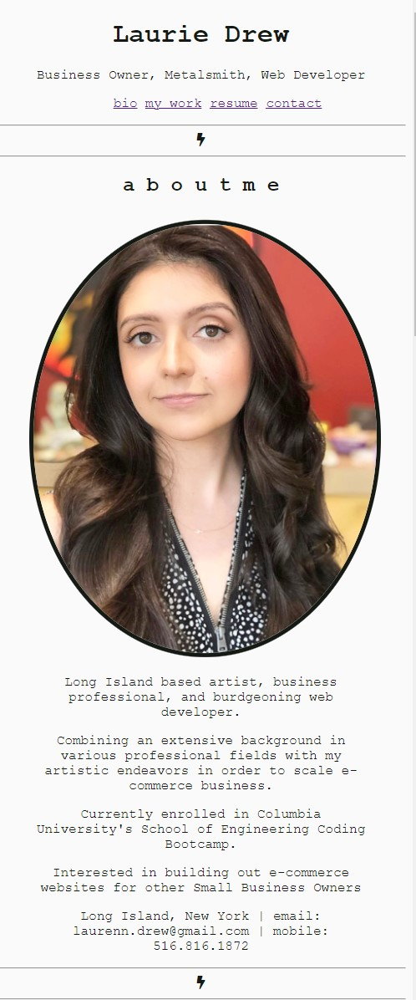
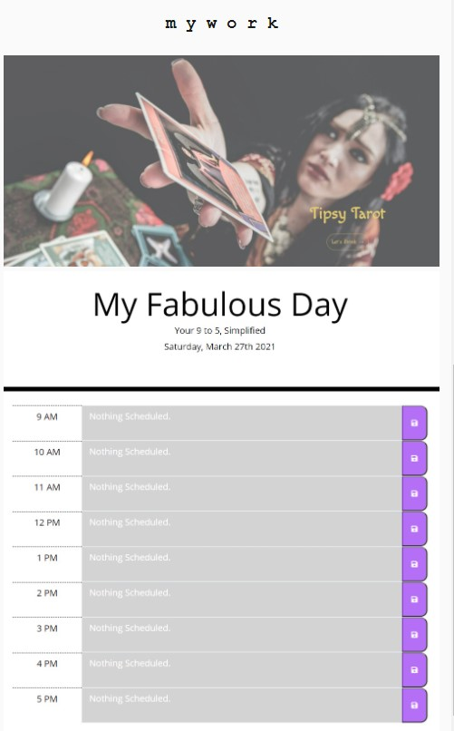
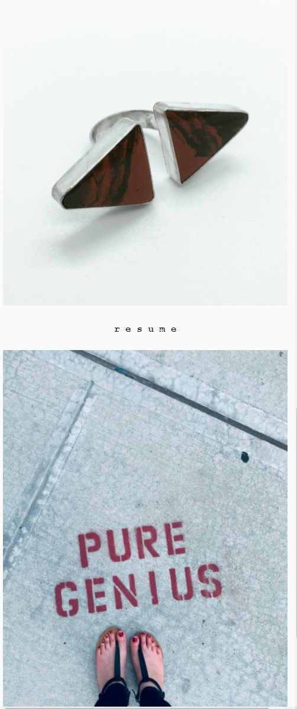
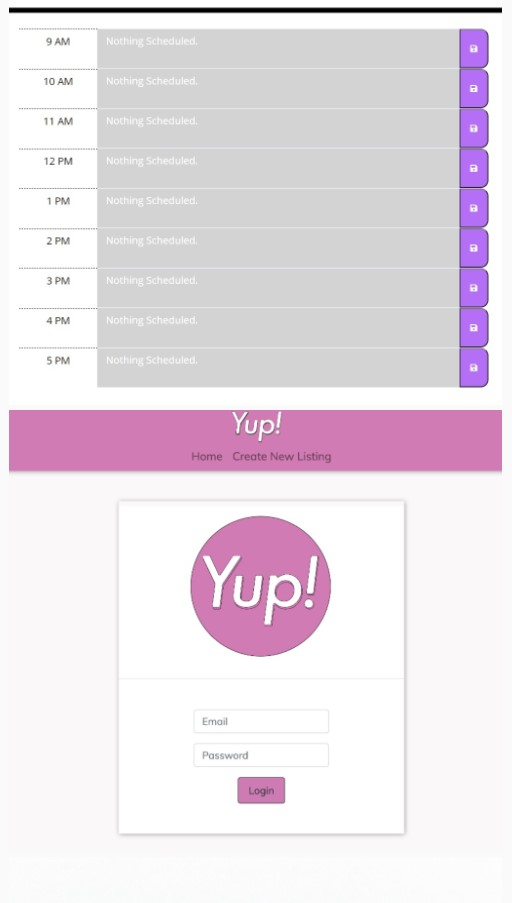

Professional Materials 

-------------
Second update to my Developer Website, including links to most my up-to-date professional resume, LinkedIn profile, GitHub and Github repositories with most recent works of which I am proud up to and including the second capstone project of this course. 

This application uses dynamic css and html with some incorporated bootstrap javascript. 

-------------

I wanted to feature my most successful projects and assignments to date in my web development in addition to my own personal work, as eventually I would like to apply web development to my artistic endeavors by helping other small business oweners build out their websites. 

-------------

 

-------------

Originally, my professional portfolio was more colorful, as you can see here:

[Original Portfolio Demo](https://lawriedrew.github.io/Developer-Website/)

My first update to my Portfolio can be seen here:

[Portfolio 2 Demo](https://github.com/LawrieDrew/Professional-Materials.git)

For the updated version of my portfolio, I made the conscious decision to opt for a black-and-white color palette. My application images are very colorful and I felt the overall affect was too busy against a colorful backdrop. I feel black-and-white is less distracting.

-------------

In addition to my main GitHub site being linked, which provides access to my featured repositories, clicking on any of the images featured on my portfolio feed will take the potential professional connections to the respective deployed application website. Additionally, my weighty tome of a resume is fully downloadable/printable in PDF form. 

[Deployed website](https://lawriedrew.github.io/Professional-Materials-2/)

[Github URL](https://github.com/LawrieDrew/Professional-Materials-2.git)

